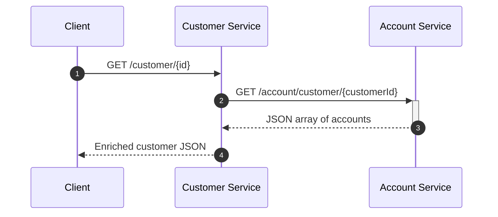

## Asynchronous Microservices with Vert.x [](https://twitter.com/piotr_minkowski)

[](https://circleci.com/gh/piomin/sample-vertx-microservices)

[](https://sonarcloud.io/dashboard?id=piomin_sample-vertx-microservices)
[](https://sonarcloud.io/dashboard?id=piomin_sample-vertx-microservices)
[](https://sonarcloud.io/dashboard?id=piomin_sample-vertx-microservices)
[](https://sonarcloud.io/dashboard?id=piomin_sample-vertx-microservices)

## Sample Vert.x Micro-services

This repository demonstrates a **poly-repo** style Vert.x 4 project written in Java 21.  
It contains two autonomous micro-services that communicate through HTTP and are discoverable via **Consul**.



### Modules
| Module | Port | Purpose |
|--------|------|---------|
| `account-vertx-service`  | 2222 | CRUD API for accounts backed by MongoDB |
| `customer-vertx-service` | 3333 | CRUD API for customers & calls Account Service |

Both are declared in the parent `pom.xml`:

```xml
<modules>
  <module>account-vertx-service</module>
  <module>customer-vertx-service</module>
</modules>
```

### Tech Stack
* Java 21  
* Vert.x 4.5.x (`vertx-web`, `vertx-service-discovery`, `vertx-web-client`)  
* MongoDB ⁄ `vertx-mongo-client`  
* Consul 8500 for service registry  
* Maven 3.9 – multi-module build  

### Building

```bash
mvn clean package
```

Each sub-module generates a **fat jar** (`*-runner.jar`) under `target/`.

### Running the services

```bash
# terminal 1
java -jar account-vertx-service/target/account-vertx-service-*-runner.jar

# terminal 2
java -jar customer-vertx-service/target/customer-vertx-service-*-runner.jar
```

Configuration is loaded from `src/main/resources/application.json`:

```json
{
  "port": 2222,
  "discovery": { "host": "localhost", "port": 8500 },
  "datasource": { "host": "localhost", "port": 27017, "db_name": "test" }
}
```

#### Prerequisites
* MongoDB listening on `27017`  
* Consul agent on `localhost:8500`  

### REST API

#### Account Service (port 2222)

| Method | Path | Description |
|--------|------|-------------|
| GET    | `/account/{id}`            | Get single account |
| GET    | `/account/customer/{cust}` | Get accounts by customer ID |
| GET    | `/account`                 | List all accounts |
| POST   | `/account`                 | Create account (body = JSON) |
| DELETE | `/account/{id}`            | Delete account |

#### Customer Service (port 3333)

| Method | Path | Description |
|--------|------|-------------|
| GET    | `/customer/{id}`        | Get customer with embedded accounts |
| GET    | `/customer/name/{name}` | Find customer by name |
| GET    | `/customer`             | List all customers |
| POST   | `/customer`             | Create customer |
| DELETE | `/customer/{id}`        | Delete customer |

### Quick test

```bash
curl -X POST localhost:2222/account \
     -H "Content-Type: application/json" \
     -d '{"number":"123","customer":"cust1","balance":100}'

curl localhost:3333/customer/cust1
```

### Service Discovery

On startup, **Account Service** registers itself in Consul:

```java
client.put(8500, "localhost", "/v1/agent/service/register").sendJsonObject(...);
```

**Customer Service** imports Consul services every 2 s via:

```java
discovery.registerServiceImporter(new ConsulServiceImporter(), jsonConfig);
```

### Contributing & License
PRs are welcome – please open an issue first.  
Distributed under the MIT License.
